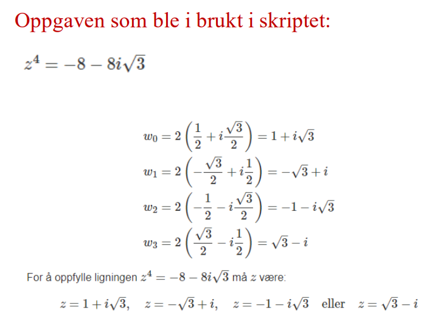

# Komplexs_roots

## Subject Mathematics 1000

This script resolves mathematical numerical problem of complex numbers on the form:  $z^n = a + bi$.

The program takes input  of:
1. number of complex solutions of the equation ( $z^n$ )
2. real part ( $a$ )
3. imaginary part of equation ( $bi$ )

Further program finds the absolute value, the phase, finds the solutions and plots it

<b>Exsample:</b>

<b>The task used in the script:</b>

